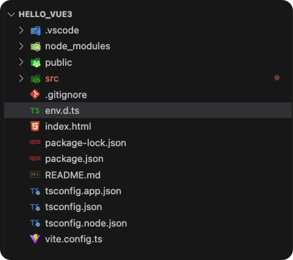
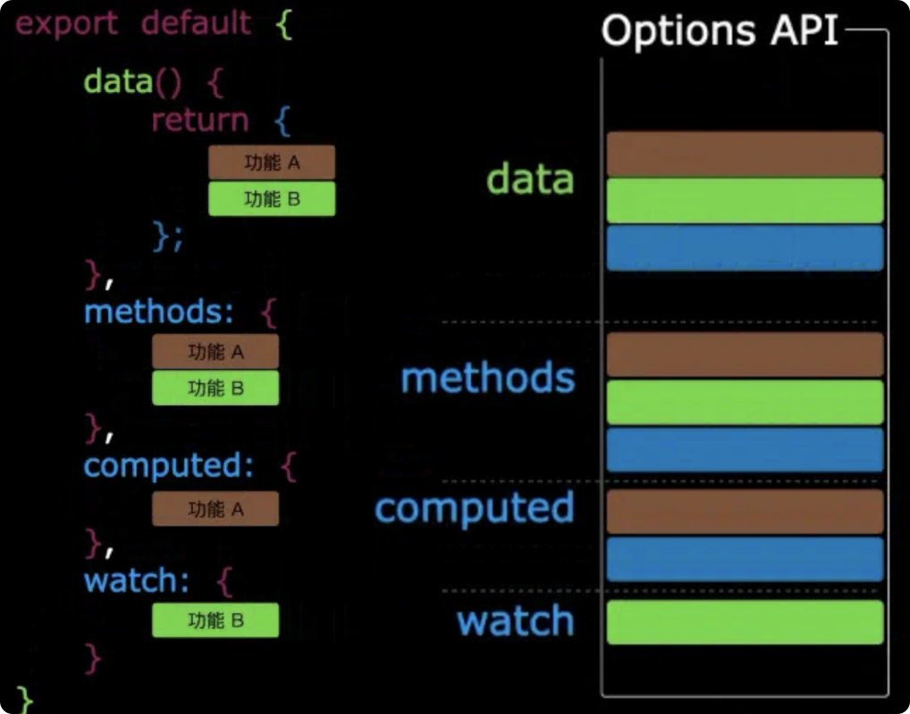
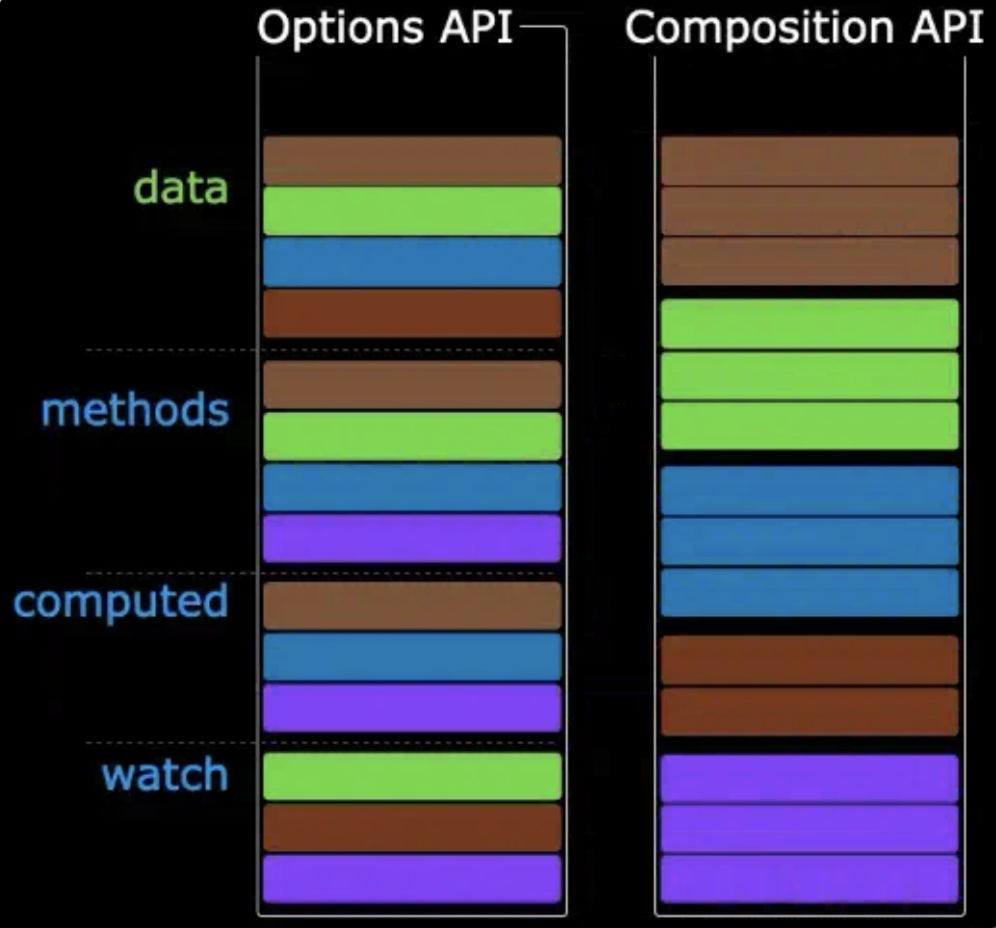

## 1. 基于vite创建Vue3工程

`vite`是新的前端构建工具，等价与`webpack`，支持快速热重载，按需编译

``` js
/// 创建vue3项目
npm create vue@latest

/// 安装项目依赖
npm i 
npm install

/// 运行dev环境
npm run dev
```

目录如下



> **.vscode**目录为vscode推荐的插件  
> **node_modules**项目依赖，通过`npm i`安装  
> **public**项目根目录  
> **src**项目源文件  
> **.gitignore**git的忽略文件  
> **env.d.ts**使得ts能识别常见的文件类型  
> **index.html**项目入口文件  
> **package-lock.json**，**package.json**包管理文件  
> **tsconfig.app.json**，**tsconfig.json**，**tsconfig.node.js**ts配置文件  
> **vite.config.ts**工程配置文件，可以安装插件，配置代理等

- 在**vite**项目中，**index.html**是项目的入口文件，再项目的最外层。
- 加载**index.html**后，**vite**解析`<script type="module" src="/src/main.ts"></script>`指向的js。
- **Vue3**是通过**createApp**函数创建一个应用实例

## 2. Vue3核心语法

### 2.1 OptionsAPI与CompositionAPI

**Vue2**的API是**Options**配置风格的  
**Vue3**的API是**Composition**组合式风格的

#### 2.1.1 Options API的弊端

**Options**类型的API，数据、方法、计算属性等，是分散在**data**、**methods**、**computed**里面的，如果需要新增或修改一个需求，需要分别修改**data**、**methods**、**computed**，不便于维护和复用

  


#### 2.1.2 Composition API优势

可以用函数的方式，将代码更合理的组合起来，让相关功能的代码有序组织在一起

  

### 2.2 Composition API

#### 2.2.1 setup

**setup**是**Vue3**中新增的一个配置项，值是一个函数，组件中所用到的数据、方法、计算属性、监视等均配置在**setup**中

其特点如下：

1. **setup**函数返回的对象中的内容，可以直接在模板中使用
2. **setup**中访问**this**是**undefined**
3. **setup**函数会在**beforeCreate**之前调用，他是先于所有钩子执行的
4. **setup**可以和**data**共存，**data**可以访问**setup**中的数据和方法，但是**setup**不能访问**data**中的数据

#### 2.2.2 ref和reactive

数据变化时页面要相应变化，数据就要用**ref**或**reactive**定义

- **ref**用于定义基础数据和对象类型数据
- **reactive**用于只能定义对象类型数据

```html
<template>
    <!-- 读取引用类型数据时，默认就读value属性 -->
    <h2>年龄：{{ age }}</h2>
    <button @click="changeAge">修改年龄</button>
    <h2>汽车品牌{{ car.name }}，价格{{ car.price }}万</h2>        
    <button @click="changeCarPrice">修改汽车价格</button>
</template>

<script setup lang="ts" name="Person">
// 引入响应式
import { reactive, ref } from 'vue'

// 数据，哪个数据需要响应，就用ref定义，基础类型数据
// age属性类型为RefImpl引用类型
// age是响应式对象，18是原对象
let age = ref(18)

// 对象类型数据用reactive定义
// car属性类型为Proxy(Object)类型
// car称为响应式对象，{}称为原对象
let car = reactive({'name': '奔驰', 'price': 100})

// 不需要变化的数据
let tel = '18099990000' 

function changeAge() {
    // 更改引用类型数据的值，用value属性修改
    age.value += 1
}

function changeCarPrice() {
    car.price += 10
}
</script>
```

- 使用**ref**定义的属性类型为`RefImpl`类型
- 使用**reactive**定义的属性类型为`Proxy(Object)`类型

> 使用**ref**定义对象类型数据时，底层将转换为**reactive**

#### 2.2.3 ref对比reactive

宏观角度：

1. **ref**用来定义：基本数据类型，对象数据类型
2. **reactive**用来定义：对象数据类型

区别

1. **ref**定义的变量必须使用`.value`访问和更改
2. **reactive**重新分配一个对象，会失去响应式（可以使用`Objective.assign`整体替换）

``` js
let car = reactive({ name: 'Cherry', price: 100 })
// 对象拷贝，否则响应式不生效
Object.assign(car, { name: 'BYD', price: 1000})
```

使用原则：

1. 若需要一个基本数据类型成为响应式数据，必须使用**ref**
2. 若要一个响应式对象，层级不深，**ref**和**reactive**都可以
3. 若响应式对象层级较深，使用**reactive**

#### 2.2.4 toRefs和toRef

当需要将响应式对象的原对象解构时，需要用到**toRef**和

- **toRef**用于结构原对象中的某一个属性
- **toRefs**用于结构原对象中的所有属性

```ts
import { reactive, toRefs, toRef } from 'vue'
let person = reactive({
    name: '章三',
    age: 19
})
// 将响应式对象的属性转换为ref对象，依然保持响应式
let {name, age} = toRefs(person)
// 只能将响应式对象中的某一个属性转换为ref对象，保持其响应式
let age1 = toRef(person, 'age')

console.log(name.value);
console.log(age1.value)
```

#### 2.2.5 计算属性

在模板表达式中写逻辑，不方便维护，可以使用计算属性来描述依赖响应式状态的复杂逻辑

```ts
// 引入响应式
import { ref, computed } from 'vue'

let firstName = ref('张')
let lastName = ref('三')

// 只读的计算属性 
let fullNameReadOnly = computed(()=>{
    return firstName.value + '-' + lastName.value
})

let fullName = computed({
    set(newValue){
        // 使用解构赋值语法
        [firstName.value, lastName.value] = newValue.split('-')
    },
    // getter函数，返回值是一个ref
    get() {
        return firstName.value + '-' + lastName.value
    }
})

function changeFullName() {
    fullName.value = '李-四'
}
```
计算属性与方法的区别在于计算属性的值会基于响应式依赖被缓存，如果依赖更新时，计算属性才会重新计算，否则不会重复执行`getter`函数

#### 2.2.6 watch监视

**watch**用于监视数据的变化，vue3中的**watch**只能监视4中数据的变化

- **ref**定义的数据
- **reactive**定义的数据
- 函数返回的一个值（`getter`函数）
- 包含上述内容的数组

在vue3中使用**watch**，会遇到以下几种情况

##### 2.2.6.1 情况一

监视ref定义的基本类型的数据，直接写属性名即可，监视的其实是value改变的值

```ts
import { ref, watch } from 'vue'

let num = ref(0)

// 监听num，不是num.value
// watch返回值是一个函数
let stopWatch = watch(num, (newValue, oldValue)=>{
    console.log('num改变', newValue, newValue);
    // 停止监视
    if (newValue > 10) {
        stopWatch()
    }
})

function changeNum() {
    num.value += 1
}
```

##### 2.2.6.2 情况二

监视**ref**定义的【对象类型】数据，直接写属性名，监视的是对象的【地址值】，若想监视对象内部的数据，要手动开启深度监视

```js
// 情况二，监视对象类型数据
let person = ref({
    name: '张三',
    age: 18
})

// 如果要监视对象内部的属性，需要开启深度监视
// 参数1：监视对象
// 参数2：监视回调
// 参数3：配置对象（deep：深度监视，immediate：立即监视）
watch(person, (newValue, oldValue) => {
    console.log('person变化', newValue, oldValue)
}, {deep: true})

function changeName() {
    person.value.name += '～'
}

function changeAge() {
    person.value.age += 1
}

function changePerson() {
    person.value = {
        name: '李四',
        age: 20
    }
}
```

> 若修改的是ref定义对象中的属性，`newValue`和`oldValue`都是新值，因为他们是同一个对象  
> 若修改整个ref定义的对象，`newValue`是新值，`oldValue`是旧值，不是同一个对象了

##### 2.2.6.3 情况三

reactive监视的对象类型数据，默认开启了深度监视

```js
// 情况三，reactive监视对象类型数据
let man = reactive({
    name: '张三',
    age: 18
})

watch(man, (newValue, oldValue) => {
    console.log('person变化', newValue, oldValue)
})

function changeManName() {
    man.name += '～'
}

function changeManAge() {
    man.age += 1
}

function changeMan() {
    // 修改的是对象里面的每一个属性，而不是新建对象替换
    Object.assign( man, {
        name: '李四',
        age: 20
    })
}
```

reactive监视的对象，隐式创建了深度监视，并且不能关闭，内部属性变化，也能监视到

##### 2.2.6.4 情况四

监视ref或者reactive定义的对象类型数据中的某个属性，注意一下：

1. 若该属性不是对象类型，需要写成函数形式
2. 若该属性是对象类型，可以直接写该属性，推荐写为函数形式

```js
let person = reactive({
    name: '章三',
    age: 10,
    car: {
        c1: '宝马',
        c2: '奥迪'
    }
})

let car = computed(() => {
    return person.car.c1 + '、' + person.car.c2
}
)

function changeName() {
    person.name += '~'
}

function changeAge() {
    person.age += 1
}

function changeC1() {
    person.car.c1 = '奥迪'
}

function changeC2() {
    person.car.c2 = '福特'
}

function changeCar() {
    person.car = {
        c1: 'Audi',
        c2: 'BMW'
    }
}

// 监视属性是基础类型，需要用getter函数，即返回值
// 监视地址值
watch(() => person.name, (newValue, oldValue) => {
    console.log('person.name变化', newValue, oldValue);
})

// car是对象类型，可以监测到内部属性的变化，但是整体car改变，不能监听到
// 如果car被整体被重新赋值，监视需要用getter函数
// 如果car属性改变和整体改变都要监视，就用getter函数，并且开启深度监视
watch(()=>person.car, (newValue, oldValue) => {
    console.log('person.car变化', newValue, oldValue);
 }, {deep:true})
```

##### 2.2.6.5 情况五

当监视多个值时，使用数组，数组的每个元素依然要符合情况四

```js
watch([()=>person.name, person.car, ()=>person.car.c1], (newValue, oldValue) => {
    // newVlaue和oldValue都是数组类型，即被监视的数组对象[person.name, person.car, person.car.c1]
    console.log('person变化', newValue, oldValue);
})
```

#### 2.2.7 watchEffect监视

立即运行监视，同时响应式的追踪其依赖，并在依赖更新时重新执行监视函数

**watch**对比**watchEffect**

1. 都能监听响应式数据的变化，不同的是监听数据变化的方式不同
2. watch需要明确制定监视的数据
3. watchEffect不需要明确指定监视的数据，函数中用到哪个数据，就监视哪个数据

```js

watch([temp, height], (value)=>{
    // 解构数据
    let [newTemp, newHeight] = value
    if (newTemp >= 60 || newHeight >= 60) {
        console.log('上报数据');
    }
})

watchEffect(() => {
    if (temp.value >= 60 || height.value >= 60) {
        console.log('上报数据');
    }
})
```

#### 2.2.8 标签的ref属性

标签的ref属性，用于注册模板引用

- ref用在普通的DOM标签上，获取到的是DOM节点
- ref用在组件标签上，获取到的是组件的实例对象

用在普通DOM标签上
```html
<template>
    <h2 ref="title2">标题2</h2>
    <button @click="showLog">展示h2</button>
</template>

<script setup lang="ts" name = 'Person'>
// 引入响应式，监视
import { ref, defineExpose } from 'vue'

let title2 = ref()
let a = ref(1)
let b = 2

function showLog() {
    console.log(title2.value);
}

// vue3中，将Person组件的属性暴露出去
defineExpose({a, b})
</script>
```

用在组件标签上

```html
<template>
    <Person ref="man"></Person>
    <button @click="showPersonProperty">显示Person实例的属性</button>
</template>

<!-- 脚本 ts或js -->
<script lang="ts" setup name="App">
import Person from './components/Person.vue'

import {ref} from 'vue'

let man = ref()

function showPersonProperty() {
    // Proxy(Object) {a: RefImpl, b: 2, __v_skip: true}
    console.log(man.value);
}
```

#### 2.2.9 props属性

组件要显示声明其接收的属性props，外部组件才能知道传入那些props。使用`defineProps`宏来声明props

声明一个类型Person

```js
// 定义一个接口，接口内的属性name、id、age
// export 表示单个暴露
export interface PersonInterface {
    name: string,
    age: number,
    id: string,
    // 可选类型
    gender?:number
}

// 给一个person数组取别名为PersonList
export type PersonList = Array<PersonInterface>
```

在`setup`中，声明接收的属性，当父组件传入这些属性时，可以直接在temp模板中使用这些属性

```html
<template>
    <div class="person">
        <h2>{{ sheetTitle }}</h2>
        <ul>
            <li v-for="item in persons" :key="item.id">{{ item.name }} {{ item.age }}</li>
        </ul>
    </div>
</template>

<script setup lang="ts" name='Person'>

// 导入类型时，必须用type标记
import { type PersonInterface, type PersonList } from '@/types'
import { defineProps, reactive } from 'vue'

// 接收父组件传入的数据，组件可能传入多个数据，用数组接收
// defineProps(['sheetTitle', 'persons', 'mans'])

// 接收父组件传入的数据，同时解构
let {sheetTitle, persons} = defineProps(['sheetTitle', 'persons'])
console.log(sheetTitle, persons);

</script>
```

外部组件使用**Person**组件，传入属性值

```html
<template>
<!-- 使用:属性名传递数据，传入的值为表达式的值，否则传入的是字面量的值 -->
<Person sheetTitle="值日表" :persons="persons"/>
</template>

<script lang="ts" setup name="App">
import Person from './components/Person.vue';
import {type PersonList, type PersonInterface} from '@/types'

let persons: PersonList = [
    {name: '章三', age: 12, id:'00001'},
    {name: '赵四', age: 33, id:'00002'},
    {name: '章三', age: 12, id:'00003', gender:1}
]
</script>
```

如果组件要限制某些参数必须传入，同时未传入的参数设置默认值

```html
<script>
// 接受数据，并限定传入数据的类型
// defineProps<{persons: PersonList}>()

// 接收数据，限制类型，限制必填，设置默认值
withDefaults(defineProps<{sheetTitle?:string, persons:PersonList, womens?:PersonList}>(), {
    // 返回值必须通过函数的形式返回
    womens: ()=>[{name:'李姐', age:12, id:'00005', gender:1}],
    sheetTitle: ()=> "值日表"
})
</script>
```

### 2.3 路由

路由指请求路径和资源（组件）之间的对应关系，不同的事件（路径）显示不同的页面内容，是事件与事件函数之间的对应关系。使用Vue路由，先要通过`npm install vue-router`安装路由插件

示例为点击按钮切换页面的功能

```ts
import About from "@/components/About.vue";
import Home from "@/components/Home.vue";
import News from "@/components/News.vue";
import { createRouter, createWebHistory } from "vue-router";

const router = createRouter({
    // 路由器工作模式
    history: createWebHistory(),
    // 路由规则
    routes: [{
        path: '/home',
        component: Home
    }, {
        path: '/news',
        component: News
    }, {
        path: '/about',
        component: About
    }, {
        // 首页重定向
        path: '/',
        redirect: '/home'
    }
    ]
})
/// 向外抛出
export default router
```

在`main`文件中使用路由

```ts
// 引入App根组件
import App from "./App.vue";
import router from "./router";

// 创建app
let app = createApp(App)
// 使用路由
app.use(router)
// 挂载为app
app.mount('#app')
```

`App`组件中切换路由

```html
<template>
    <h2 class="title">学习Vue路由</h2>
    <!-- 导航区 -->
    <div class="navigate">
        <!-- RouterLink组件设置路径是使用to -->
        <RouterLink to="/home" active-class="active"> 首页 </RouterLink>
        <RouterLink to="/news" active-class="active"> 新闻 </RouterLink>
        <RouterLink to="/about" active-class="active"> 关于 </RouterLink>
    </div>

    <!-- 展示区 -->
    <div class="main-content">
        <RouterView></RouterView>
    </div>
</template>

<script lang="ts" setup name="App">
    // 导入
import { RouterView, RouterLink } from 'vue-router';
</script>
```

> 路由组件通常放在pages目录内，一般组件通常放在components目录内

### 2.3.1 路由器工作模式

- `history`模式
    - `URL`更美观，不带有`#`，更接近传统网站的`URL`
    - 后期项目上线，需要服务端配合处理路径问题，否则刷新会有404错误
- `hash`模式
    - 兼容性更好，不需要服务端处理路径
    - `URL`带有`#`，不美观，且`SEO`优化方面相对较差


### 2.3.2 路由跳转方式

当设置路由时，可以设置路由的名字

```ts
const router = createRouter({
    // 路由器工作模式
    history: createWebHistory(),
    // 路由规则
    routes: [{
        name: 'homePage',
        path: '/home',
        component: Home
    }, {
        name: 'xinwen'
        path: '/news',
        component: News
    }, {
        path: '/about',
        component: About
    }
    ]
})
```
路由跳转时，有三种写法

```html
<!-- 通过字符串跳转 -->
<RouterLink to="/home" active-class="active"> 首页 </RouterLink>
<!-- 通过对象名字跳转 -->
<RouterLink :to="{name: 'xinwen'}" active-class="active"> 新闻 </RouterLink>
<!-- 通过对象路径跳转 -->
<RouterLink :to="{path: '/about'}" active-class="active">关于</RouterLink>
```


### 2.3.4 路由传参

#### 2.3.4.1 query传参

设置`News`组件的子路由

```ts
{
    name: 'xinwen',
    path: '/news',
    component: News,
    children: [
        {
            name:'xiang',
            path:'detail',
            component: NewDetail
        }
    ]
}
```
`query`传参，可以将参数直接拼接到`url`后面，也可以使用`query`参数传入对象

```html
<!-- query传参一 -->
<RouterLink :to="`/news/detail?id=${news.id}&title=${news.title}&content=${news.content}`">{{ news.title }}</RouterLink>

<!-- query传参二 -->
<RouterLink :to="{
    // path: '/news/detail',
    name: 'xiang',
    query: {
        id: news.id,
        title: news.title,
        content: news.content
    }
}"> {{ news.title }}</RouterLink>
```

在`NewDetail`组件中，回显传入的参数

```html
<template>
    <li>编号：{{ query.id }}</li>
    <li>标题：{{ query.title }}</li>
    <li>内容：{{ query.content }}</li>
</template>

<script lang="ts" setup name="NewDetail">

import { toRefs } from 'vue';
import { useRoute } from 'vue-router'

let route = useRoute()
let {query} = toRefs(route)

</script>
```

#### 2.3.4.2 param参数传递

使用`param`传参，使用`to`的对象写法时，必须使用`name`配置项，不能用`path`；并且不能传入数组和对象

设置`News`组件的子路由

```ts
{
    name: 'xinwen',
    path: '/news',
    component: News,
    children: [
        {
            name:'xiang',
            // 参数占位，？标记为非必填
            path:'detail/:id/:title/:content?',
            component: NewDetail
        }
    ]
}
```
使用路由

```html
<!-- param传参一 -->
<RouterLink :to="`/news/detail/${news.id}/${news.title}/${news.content}`">{{ news.title }}</RouterLink>
<!-- param传参二 -->
<RouterLink :to="{
    name: 'xiang',
    // path: '/news/detail',
    // 不能传入数组
    params: {
        id: news.id,
        title: news.title,
        content: news.content
    }
}">{{ news.title }}</RouterLink>

```

详情组件中显示传入参数

```html
<li>编号：{{ route.params.id }}</li>
<li>标题：{{ route.params.title }}</li>
<li>内容：{{ route.params.content }}</li>

<script>
    let route = useRoute()
</script>
```

### 2.3.5 路由props配置

路由props配置可以让路由组件更方便的接收参（可以将路由参数作为props传给组件）

```ts
name: 'xinwen',
path: '/news',
component: News,
children: [
    {
        name:'xiang',
        path:'detail/:id/:title/:content',
        component: NewDetail,
        // 将路由收到的所有参数作为props传给路由组件，适用param传参
        // props: true

        // 函数写法，适用query和param传参
        props(route) {
            return route.params
        }
    }
]
```

```html
<template>
    <li>编号：{{ id }}</li>
    <li>标题：{{ title }}</li>
    <li>内容：{{ content }}</li>
</template>

<script lang="ts" setup name="NewDetail">
    defineProps(['id', 'title', 'content'])
</script>
```

### 2.3.6 编程式路由导航

使用代码去做路由跳转，而不是点击事件

``` ts
const router = useRouter()
function showNewsDetail(news: any) {
    // 编程式路由
    router.push({
        name: 'xiang',
        params: {
            id: news.id,
            title: news.title,
            content: news.content
        }
    })
}
```

## 3. pinia集中式状态管理

集中式状态管理用于管理多个组件之间共享的数据

### 3.1 搭建pinia环境

使用`npm i pinia`安装`pinia`

``` ts
import { createPinia } from "pinia";
// 创建app
let app = createApp(App)
let pinia = createPinia()
app.use(pinia)
app.mount('#app')
```

### 3.2 存储和读取数据

`pinia`中`Store`是一个保存状态、业务逻辑的实体，每个组件都可以读取和写入
`Store`有三个概念：`state`、`getter`、`action`相当于组件中的`data`、`computed`、`methods`。Store的文件名和组件名保持一致。

```ts
// 引入definStore用于创建store
import { defineStore } from "pinia";

// 创建并暴露store
export const useCountStore = defineStore('count', {
    // 动作函数，响应组件中的事件
    actions: {
        increment(value: number) {
            // this表示当前的store
            this.num += value
        }
    },
    // 状态
    state() {
        return {
            num: 1,
            option: 1,
            name: 'kai'
        }
    },
    // 计算
    getters: {
        bigNum(): number {
            return this.num * 10
        },
        upperName(state): string {
            return state.name.toUpperCase()
        },
        option: state => state.option
    }
})
```

使用Store

```html
<h2>当前求和为 {{ countStore.num }}</h2>

<script lang="ts" name='Count' setup>
import { useCountStore } from '@/store/count';
// 获取store
let countStore = useCountStore()
</script>
```

### 3.3 修改数据的三种方式

1. 直接修改

```ts
countStore.num = 2
```

2. 批量修改

```ts
// 批量修改，可以修改任意一个数据
countStore.$patch({
        num: 20
    })
```

3. 使用actions修改

```ts
countStore.increment(1)
```

### 3.4 storeToRefs解构

借助`sotreToRefs`将`store`中的数据转换为`ref`对象，方便在模板中使用

```ts
// let {num,option,name} = refs(countStore)
// storeToRefs只会关注state里面的数据，不会对方法进行ref包裹
let {num, option, name} = storeToRefs(countStore)
```
### 3.5 组合式store

```ts
export const useLoveStore = defineStore('love', () => {
    let loveList = reactive(
        JSON.parse(localStorage.getItem('talkList') as string) || []
    )

    async function getALoveTalk() {
        // 解构data内的content
        let { data: { content } } = await axios.get('https://api.uomg.com/api/rand.qinghua?format=json')
        // let { data: { content: title } }j结构后将content重命名为title
        let obj = { id: nanoid(), content }
        loveList.unshift(obj)
    }

    return {loveList, getALoveTalk}
})
```

## 4. 组件通信

### 4.1 props

`props`是使用频率最高的通信方式，常用语父组件和子组件之间传递数据

- 父组件传子组件：属性值是**非函数**
- 子组件传父组件：属性值是**函数**

父组件
```html
<template>
    <Child :car="car" :sendToy="getToy"></Child>
</template>

<script lang="ts" setup name="Father">
import Child from './Child.vue';
let car = ref('小米SU7 Ultra')
let toy = ref('')

function getToy(value: string) {
    toy.value = value
}
</script>

<style scoped></style>
```

子组件

```html
<template>
    <button @click="sendToy(toy)">将玩具传给父组件</button>
</template>

<script lang="ts" setup name="Child">
/// 声明接收car和发送数据的方法
defineProps(['car', 'sendToy'])
let toy = ref('托宝战士')

</script>

<style scoped></style>
```

### 4.2 自定义事件

自定义事件常用语父组件向子组件传递事件，注意区分原生事件和自定义事件
- 原生事件：
  - 事件名是特定的（`click`、`input`等）
  - 事件对象`$event`：是包含事件相关信息的对象（`pageX`、`pageY`、`target`、`keyCode`）
- 自定义事件：
  - 事件名任意
  - 事件对象`$event`：是调用emit时所提供的参数，可以是任意类型

```html
<!-- 命名遵循烤串命名 -->
<!-- 给子组件绑定sendToy事件，当这个事件触发时，执行getToy函数 -->
<Child @send-toy="getToy"></Child>
```

子组件通过`emit`执行自定义事件
```html
<template>
    <button @click="emit('send-toy', toy)">传出玩具</button>
</template>

<script lang="ts" setup name="Child">
let toy = ref('变形金刚')
// 申明事件
let emit = defineEmits(['send-toy'])
</script>
<style scoped></style>
```

### 4.3 mitt

使用`npm i mitt`安装`mitt`，`mitt`实现任意组件间的通讯，消息订阅与发布机制

创建`src/utils/emitter.ts`文件

```ts
import mitt from "mitt";
// 调用mitt得到emitter，绑定事件，触发事件
const emitter = mitt()
// 暴露emitter
export default emitter
```

在接收数据的组件中绑定事件，并在组件卸载时解绑事件

``` html
<script lang="ts" setup name="Father">
import emitter from '@/utils/emitter';

let toy = ref('')

/// 绑定事件
emitter.on('send-toy', (value: string) => {
    toy.value = value
})

/// 解绑事件
onUnmounted(()=>{
    emitter.off('send-toy')
})

</script>
```

在提供数据组件中，触发事件

```html
<template>
    <button @click="emitter.emit('send-toy', toy)">发送玩具</button>
</template>

<script lang="ts" setup name="Child">
import emitter from '@/utils/emitter';
import { ref } from 'vue';

let toy = ref('旋风冲锋')
</script>

```

### 4.4 v-model双向绑定

`v-model`用于实现父组件和子组件的相互通信

#### 4.1 v-model的本质

```html
<!-- v-model用在html标签上 -->
<input type="text" v-model="userName">
<!-- 本质执行如下代码 -->
<input type="text" :value="userName" @input="userName=(<HTMLInputElement>$event.target).value">
```

#### 4.2 使自定义组件中支持v-model

在组件中使用`v-model`，实际上为

```html
<!-- v-model用在组件标签上 -->
<CusInput v-model="userName"></CusInput>
<!-- 等价于 -->
<CusInput :modelValue="userName" @update:modelValue="userName = $event"></CusInput>

```
其中`modelValue`是默认的参数名，`update:modelValue`是默认的方法名

在`CusInput`组件中

```html
<template>
    <!-- :value：将接收的value传递给input的value属性 -->
    <!-- @input：将input元素绑定给原生input事件，触发此事件是，会执行update:modelValue事件 -->
    <input type="text" 
    :value="modelValue"
    @input="emit('update:modelValue', (<HTMLInputElement>$event.target).value)">
</template>

<script setup lang="ts" name="CusInput">
// 接收props
defineProps(['modelValue'])
// 声明事件
let emit = defineEmits(['update:modelValue'])
</script>
```

#### 4.3 更改v-model中modelValue名

`modelValue`可以更改为其他名字，这样组件可以使用多个`v-model`

```html
<!-- Input定义了mingzi和mima两个属性 -->
<Input v-model:mingzi="userName" v-model:mima="passWord"></Input>
```
在`Input`组件中

```html
<template>
    <input type="text" :value="mingzi" @input="emit('update:mingzi', (<HTMLInputElement>$event.target).value)">
    <br>
    <input type="text" :value="mima" @input="emit('update:mima', (<HTMLInputElement>$event.target).value)">
</template>

<script setup lang="ts" name="Input">

defineProps(['mingzi', 'mima'])
let emit = defineEmits(['update:mingzi', 'update:mima'])

</script>
```

### 4.5 $attrs

`$attra`用于向爷祖组件之间的通讯  
`$attra`是一个对象，包含所有父组件传入的标签属性
> `$attra`会自动排除props中申明的属性

父组件
```html
<Child :a="a" :b="b" v-bind="{'c':100, 'd':90}" :changeA="changeA"/>
```

子组件
```html
<template>
    <!-- $attra中不包括a属性 -->
    <GrandChild v-bind="$attrs"/>
</template>

<script setup lang="ts" name="Child">
import GrandChild from './GrandChild.vue';
defineProps(['a'])
</script>
```

孙组件
```html
<template>
    <h5>【b：{{b}}】【c：{{c}}】</h5>
    <button @click="changeA(4)">a+4</button>
</template>

<script setup lang="ts" name="GrandChild">
defineProps(['b', 'c', 'changeA'])
</script>
```

### 4.6 \$refs和\$parent

- `$refs`用于父元素向子元素传递数据，其值为数组，包含所有被`ref`属性标识的`DOM`元素或组件实例
- `$parent`用于子元素向父元素传递数据，其值为对象，表示当前父组件这个实例对象

### 4.7 provide和inject

`provide`和`inject`用于实现祖孙组件之间的通讯

1. 现在祖先组件中通过`provide`配置向后代组件提供数据
2. 在后代组件中通过`inject`配置来声明接收数据

父组件中

```ts
let money = ref(100)
let car = reactive({
    brand: '奔驰',
    price: 20
})

function changeMoney(value: number) {
    money.value -= value
}

provide('moneyContext', {money, changeMoney})
provide('car', car)
```

后代组件中，使用`inject`接收数据

```js
// 第一个参数表示参数名，第二个参数表示默认值
let {money, changeMoney} = inject('moneyContext', {money:0, changeMoney:(x:number)=>{}})
let car = inject('car', {brand:'', price:0})
```


